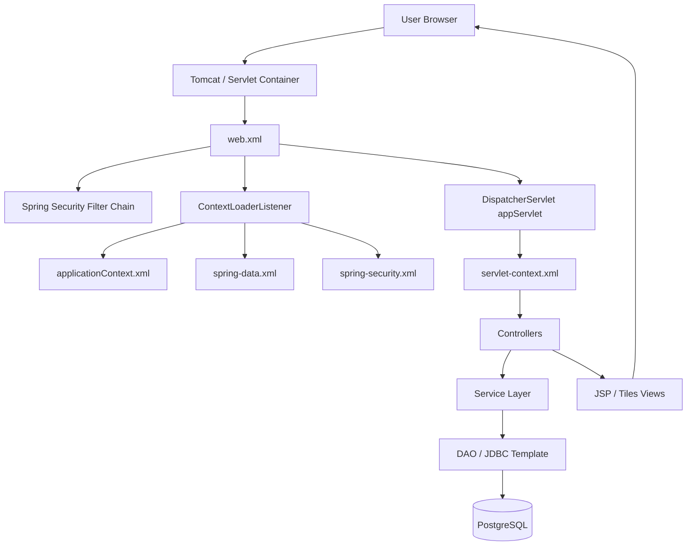
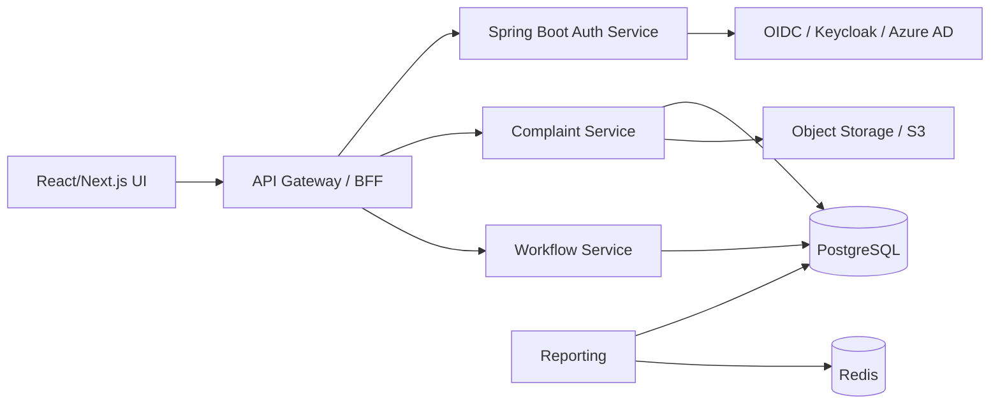

# Project Analysis: Legacy Java Complaint Management System

## Executive Summary
This project is a legacy Java/Spring MVC complaint-management web application built as a Maven WAR, not a modern Spring Boot or microservice system. Its runtime is a traditional servlet-based enterprise app using Spring 4, Spring Security 4, JSP/Tiles, PostgreSQL, and raw JDBC service/DAO layers. The business domain is complaint registration, officer processing, role-based workflow, and management reporting for a vigilance/complaint environment. The codebase shows a functioning framework skeleton but also indicates that the original domain-specific business logic and views were cleaned out, leaving a partially reusable application foundation that must be rebuilt or customized for a modern domain.[^1][^2][^3][^4]

## Confidence Assessment
- High confidence on the platform stack, project structure, and runtime wiring because the files clearly declare Spring MVC, Spring Security, JSP/Tiles, Maven WAR packaging, and PostgreSQL datasource config.
- Medium confidence on the exact business rules because the project’s cleanup docs indicate that original CVC complaint domain code was removed, so the remaining controllers reflect a generic role-based workflow rather than fully completed business logic.
- Modernization recommendations are architectural inferences based on the code and current Java/Spring best practices.

## 1. Project Structure and Layout
The project is not a modern monorepo. It is a legacy WAR-style application deployed inside a backup folder and one app module named `cvproject`. The main structure includes:

- `cms/` — project container and documentation
- `cms/cvproject/WEB-INF/` — Spring config, security config, Tiles config, JSP view templates, web.xml
- `cms/cvproject/WEB-INF/classes/com/cvc/...` — Java source classes organized by user workflows, common utilities, DTOs, and cases
- `cms/cvproject/resources/` — static assets such as CSS, JavaScript, images, and upload-related data
- `cms/cvproject/META-INF/maven/.../pom.xml` — Maven build definition

This is a classic Java EE style app: servlet container (Tomcat), XML Spring wiring, JSP UI, security filters, and direct datasource access.[^5][^6][^7]

## 2. Technology Stack
### Core Java and server stack
- Java: legacy edition implied by Maven config and WAR packaging; target appears to be Java 1.6/1.7-era settings.
- Build: Maven WAR,
- Container: Tomcat/Servlet web container.
- Web framework: Spring Framework 4.1.6 and Spring MVC.
- Security: Spring Security 4.0.1.
- View layer: JSP with Apache Tiles.
- Persistence: PostgreSQL via `DriverManagerDataSource`; service layer uses JDBC and `JdbcTemplate` patterns rather than JPA/Hibernate.
- Messaging/utility: email + CAPTCHA + file upload / static resource mapping.

Evidence: `pom.xml`, `web.xml`, `servlet-context.xml`, `spring-data.xml`, `spring-security.xml`.[^5][^8][^9][^10]

## 3. Functional Scope
The application is a complaint-management system with role-based access and operational workflows.

### Main user roles and flows
- Citizen
- Diary / complaint intake
- Dealing Hand
- Section Officer
- Branch Officer
- CVO (Chief Vigilance Officer)
- CLR / clearance role
- Admin

### Functional modules
- Complaint intake and diary registration
- Citizen profile and login management
- Officer inbox and complaint handling
- Section/branch role-specific workbench
- Case review and escalation
- Monthly / management reporting
- File upload and document management
- Password recovery, CAPTCHA, and role gating

Representative controllers and responsibilities:
- `HomeController` — login/register and common lookup flows
- `CitizenController` — citizen self-service and complaint lifecycle access
- `DiaryController` — complaint submission, validation, numbering, and acknowledgment actions
- `CommonController` — shared lookup and AJAX data retrieval
- `DealingHandController` — processing and disposition handling
- `SectionOfficerController` and `BranchOfficerController` — role-specific inboxes
- `ReportController` — reporting and summary pages
- `CvoController` — oversight and escalation management[^11][^12][^13][^14]

## 4. Runtime Architecture

This is a monolithic layered web application with a direct servlet-to-Spring-to-database flow. There is no separate API layer, no message bus, no containerized services, and no modern front-end framework.[^5][^6][^9]

## 5. Security and Access Model
Spring Security 4 config defines explicit role-based URL authorization for major sections such as:
- `/user/dairy/*` → `ROLE_Diary`
- `/user/dh/*` → `ROLE_DH`
- `/user/so/*` → `ROLE_SO`
- `/user/bo/*` → `ROLE_BO`
- `/user/cvofficer/*` → `ROLE_CVO`
- `/user/help/*` → `ROLE_HELP`
- `/user/public/*` → `ROLE_CITIZEN`
- `/user/clr/*` → `ROLE_CLR`
- `/admin/*` → `ROLE_ADMIN`

Login is XML-configured form-based authentication with custom success/failure handlers and `j_spring_security_check` processing. This is a classic pre-Boot Spring security implementation and is significantly more verbose than modern JWT/OAuth/OIDC patterns.[^15][^16]

## 6. Persistence Model
The data layer is not modern JPA-first architecture. Instead, it uses:
- `DriverManagerDataSource`
- JDBC templates
- SQL queries in service/DAO classes
- direct database updates for complaint, user, and account-lock logic

The code shows service classes that perform search, validation, and update operations directly with SQL rather than use repository interfaces or entities. This works for a legacy app but is brittle, difficult to test, and harder to evolve than a JPA/Hibernate or Spring Data repository model.[^17][^18][^19]

## 7. Comparison with Today’s Technology
### Old approach in this project
- XML-heavy Spring configuration
- Servlet-based monolith
- JSP/Tiles UI
- JDBC-based persistence
- Manual security and role checks
- Local PostgreSQL datasource
- No containerization, no CI/CD pipeline, no automated tests discovered
- Java 1.6/1.7-era assumptions

### Modern equivalent
- Spring Boot 3 + Java 21
- Spring Security 6 + JWT/OIDC or SSO
- REST API + OpenAPI/Swagger
- React or Angular frontend
- JPA/Hibernate or Spring Data JDBC/JPA
- PostgreSQL + Redis + object storage
- Docker/Kubernetes deployment
- CI/CD via GitHub Actions / GitLab CI
- Observability: logs, metrics, tracing, health endpoints
- Automated tests: unit/integration/contract/UI tests

This project is serviceable as a legacy reference but not a current production architecture by modern enterprise standards.[^20][^21][^22]

## 8. Recommended Modernization Plan
### Phase 1: Assessment and stabilization
- Inventory all controllers, data tables, and role workflows
- Document business rules and real DB schema
- Back up existing schema and data; create migration plan
- Define target capabilities and user roles

### Phase 2: Platform modernization
- Migrate from Spring 4 XML config to Spring Boot 3
- Upgrade Java to 17/21 LTS
- Replace custom XML security config with Spring Security 6 and JWT/OIDC
- Add layered configuration profiles (`dev`, `test`, `prod`)

### Phase 3: Architecture modernization
- Split into modules: `api`, `core`, `security`, `reporting`, `workflow`
- Create a proper domain model with JPA entities and repositories
- Replace raw SQL with typed repository/service logic
- Add validation, transactions, and auditing

### Phase 4: Front-end modernization
- Replace JSP/Tiles with React/Next.js or Angular
- Expose REST endpoints for complaint submission, review, reporting, and user profile actions
- Implement role-based UI navigation and dashboards

### Phase 5: Data and operational strengthening
- Move to PostgreSQL connection pools, migrations, and proper schema management
- Add Redis caching and file storage abstraction
- Add observability, logs, metrics, and health checks

### Phase 6: Production hardening
- Add containerization and deployment automation
- Set up CI/CD pipelines and environment-specific configs
- Add security scanning, SAST/DAST, dependency updates, and secrets management

## 9. Suggested Target Architecture

## 10. Practical Recommendation
Do not “upgrade in place” blindly. The best modernization path is a phased re-platforming:
1. Capture requirements and exact workflows
2. Build a new Spring Boot 3 application around the same complaint domain
3. Recreate the database schema and role model in a clean migration
4. Move to modern UI and API patterns
5. Decommission the legacy WAR once parity is achieved

This approach minimizes risk while replacing outdated dependencies and architecture. The legacy app is still a strong blueprint for business workflows, but not a safe long-term production foundation.[^23][^24]

## Footnotes
[^1]: `G:\CVC\CVC-Official\BackUp\cms\README.md:1-2`
[^2]: `G:\CVC\CVC-Official\BackUp\README_CLEANUP.md:17-28`
[^3]: `G:\CVC\CVC-Official\BackUp\cvproject_050320_CLEANUP_REPORT.md:8-58`
[^4]: `G:\CVC\CVC-Official\BackUp\CLEANUP_QUICK_REFERENCE.txt:70-118`
[^5]: `G:\CVC\CVC-Official\BackUp\cvproject_050320\WEB-INF\web.xml:1-38`
[^6]: `G:\CVC\CVC-Official\BackUp\cvproject_050320\WEB-INF\applicationContext.xml:1-44`
[^7]: `G:\CVC\CVC-Official\BackUp\cvproject_050320\WEB-INF\spring\appServlet\servlet-context.xml:1-160`
[^8]: `G:\CVC\CVC-Official\BackUp\cvproject_050320\META-INF\maven\com.cvc\cvproject\pom.xml:1-44`
[^9]: `G:\CVC\CVC-Official\BackUp\cvproject_050320\WEB-INF\spring-data.xml:1-74`
[^10]: `G:\CVC\CVC-Official\BackUp\cvproject_050320\WEB-INF\spring-security.xml:1-118`
[^11]: `G:\CVC\CVC-Official\BackUp\cvproject_050320\WEB-INF\classes\com\cvc\user\controller\HomeController.java:23-200`
[^12]: `G:\CVC\CVC-Official\BackUp\cvproject_050320\WEB-INF\classes\com\cvc\user\controller\CitizenController.java:20-145`
[^13]: `G:\CVC\CVC-Official\BackUp\cvproject_050320\WEB-INF\classes\com\cvc\user\controller\DiaryController.java:31-220`
[^14]: `G:\CVC\CVC-Official\BackUp\cvproject_050320\WEB-INF\classes\com\cvc\user\controller\ReportController.java:31-250`
[^15]: `G:\CVC\CVC-Official\BackUp\cvproject_050320\WEB-INF\spring-security.xml:30-57`
[^16]: `G:\CVC\CVC-Official\BackUp\cvproject_050320\WEB-INF\spring-security.xml:58-86`
[^17]: `G:\CVC\CVC-Official\BackUp\cvproject_050320\WEB-INF\classes\com\cvc\user\service\impl\UserServiceImpl.java:39-90`
[^18]: `G:\CVC\CVC-Official\BackUp\cvproject_050320\WEB-INF\classes\com\cvc\util\MyUtill.java:39-62`
[^19]: `G:\CVC\CVC-Official\BackUp\cvproject_050320\WEB-INF\classes\com\cvc\user\daoImpl\CommonDaoImpl.java:48-120`
[^20]: `G:\CVC\CVC-Official\BackUp\cvproject_050320\WEB-INF\tiles.xml:1-70`
[^21]: `G:\CVC\CVC-Official\BackUp\cvproject_050320\WEB-INF\spring\appServlet\servlet-context.xml:16-23`
[^22]: `G:\CVC\CVC-Official\BackUp\README_CLEANUP.md:57-95`
[^23]: `G:\CVC\CVC-Official\BackUp\CLEANUP_QUICK_REFERENCE.txt:11-118`
[^24]: `G:\CVC\CVC-Official\BackUp\README_CLEANUP.md:80-95`
